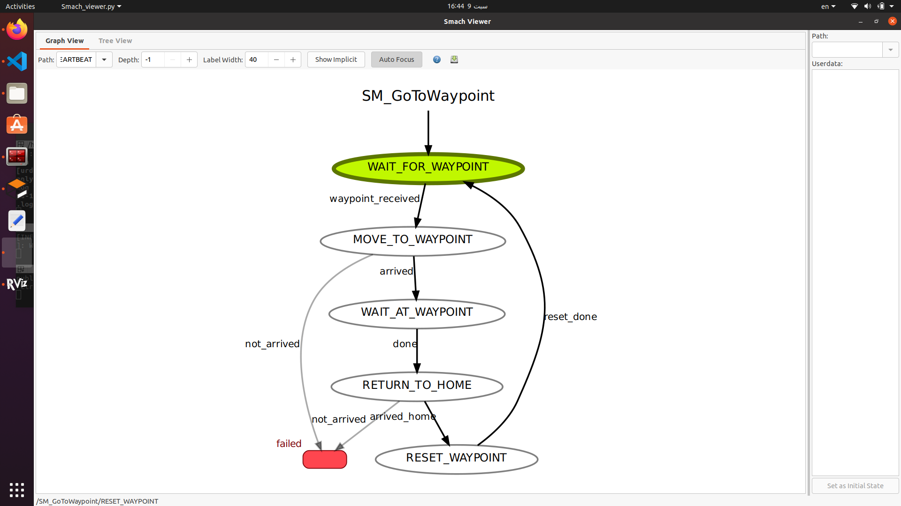

# SMACH

## Overview

This package contains a ROS SMACH state machine designed to control a robot's navigation. The state machine subscribes to the `/waypoints` topic to receive navigation goals and executes a sequence of states to move the robot from a home pose to a waypoint, wait for a two minutes , and return to the home pose.

## Package Structure

* **robot_smach/** : Main package directory
* **src/** : Source files
  * **robot_smach.py** : Main SMACH state machine script

## Installation

1. **Clone the Repository**

```bash
https://github.com/arche-robotics-internship/SMACH
git checkout pr_smach_task 
```

 **2. Build the Package**

Navigate to your ROS workspace and build the pkg

```bash
catkin_make
```

3. **Source the Workspace**

```
source devel/setup.bash

```

## Usage

##### **1. First Run the package of the robot in gazebo world**

```bash
roslaunch skid_steer_robot world.launch
```

##### 2. Run the Navigation Package

```bash
roslaunch navigation navigation.launch 
```

##### **3. Publish Waypoints**

Publish waypoint data to the `/waypoints` topic. For example, use:

```bash
rostopic pub /waypoints geometry_msgs/PoseArray "header:
  stamp:
    secs: 0
    nsecs: 0
  frame_id: 'map'
poses:
- position:
    x: 2.0
    y: 3.0
    z: 0.0
  orientation: 
    x: 0.0
    y: 0.0
    z: 0.5
    w: 0.5"
```

##### **4. Run the SMACH State Machine**

Execute the state machine script:

```bash
rosrun robot_smach robot_smach.py 
```

#### Testing in simulation


## States Description




#### **1. WaitForWaypoint**

 **Purpose** : Waits until a waypoint is received from the `/waypoints` topic.

* **Initialization** : Sets up the state with a single outcome, `waypoint_received`.
* **Execution** : Continuously checks if `waypoint_pose` is `None`. If a waypoint has been received (`waypoint_pose` is no longer `None`), it logs a message and transitions to the `MOVE_TO_WAYPOINT` state.


#### **2. MoveToWaypoint**

 **Purpose** : Moves the robot to the waypoint specified in the `waypoint_pose`.

* **Initialization** : Creates a `SimpleActionClient` for the `move_base` action server and waits for the server to be available.
* **Execution** : Checks if `waypoint_pose` is available. If not, it logs an error and transitions to `not_arrived`. If available, it sends a navigation goal to `move_base`, waits for the result, and transitions based on whether the goal was successfully achieved or not.


#### **3. WaitAtWaypoint**

 **Purpose** : Waits for a fixed period (2 minutes) at the waypoint.

* **Initialization** : Creates a `SimpleActionClient` for the `move_base` action server.
* **Execution** : Sends a navigation goal to return to the predefined home position. Waits for the result and transitions based on whether the robot successfully arrived at home or not.


#### **4. ReturnToHome**

**Purpose**: Moves the robot back to a predefined home position.

* **Initialization** : Creates a `SimpleActionClient` for the `move_base` action server.
* **Execution** : Sends a navigation goal to return to the predefined home position. Waits for the result and transitions based on whether the robot successfully arrived at home or not.


#### **5. ResetWaypoint**

 **Purpose** : Resets the waypoint to `None`, effectively clearing the current waypoint.

* **Initialization** : Sets up the state with a single outcome, `reset_done`.
* **Execution** : Resets the global `waypoint_pose` to `None`. Logs the action and transitions to the `WAIT_FOR_WAYPOINT` state to wait for a new waypoint.
